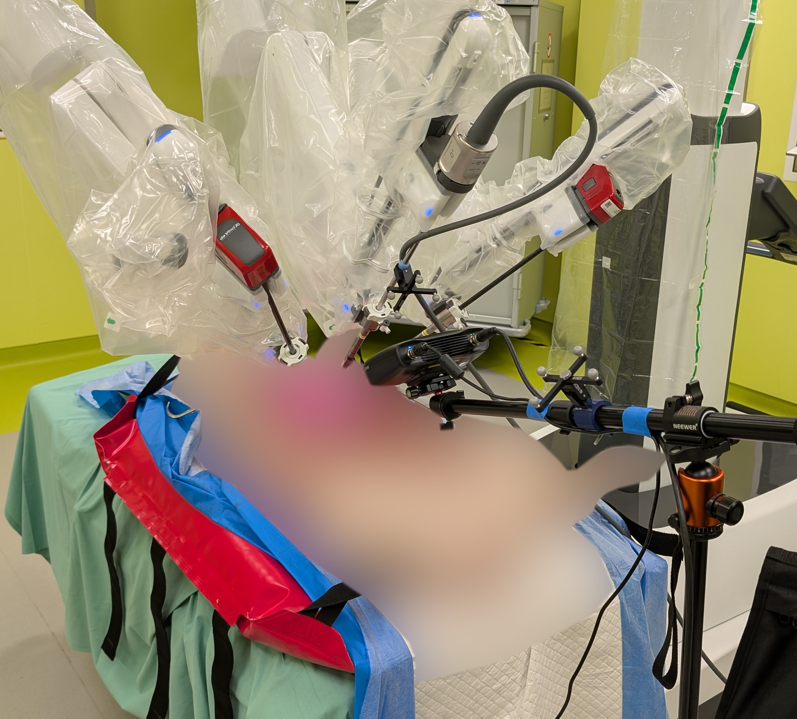
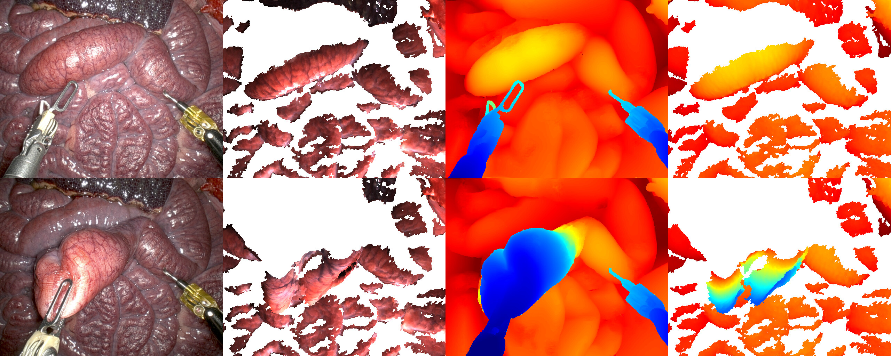
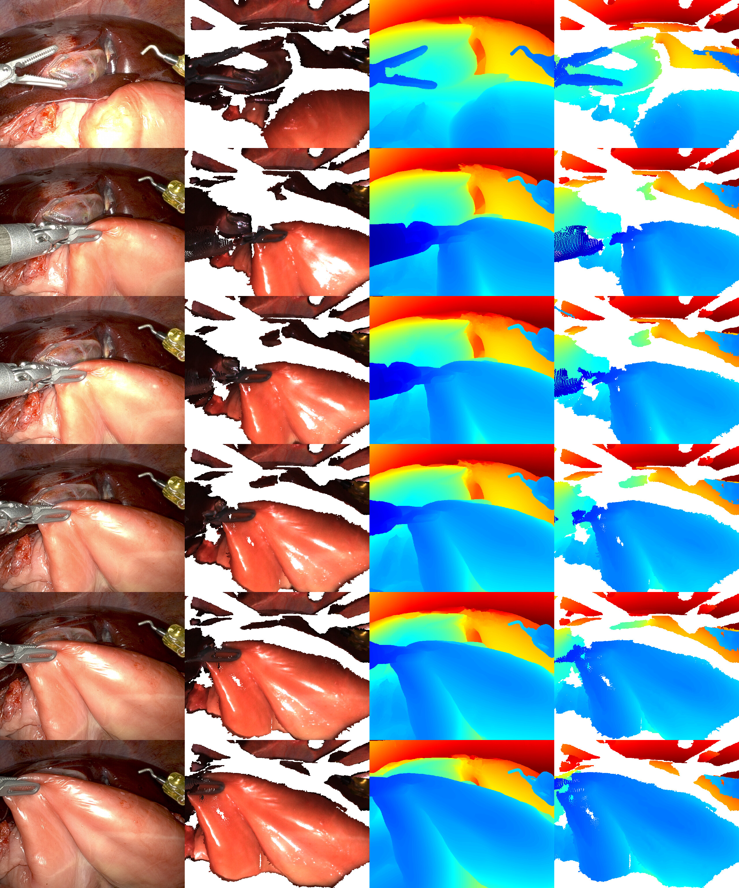
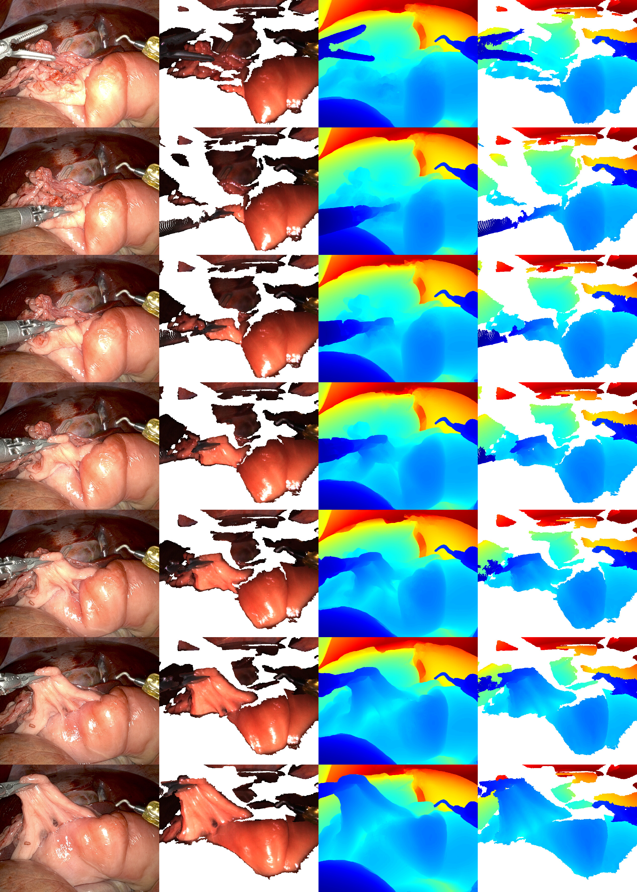
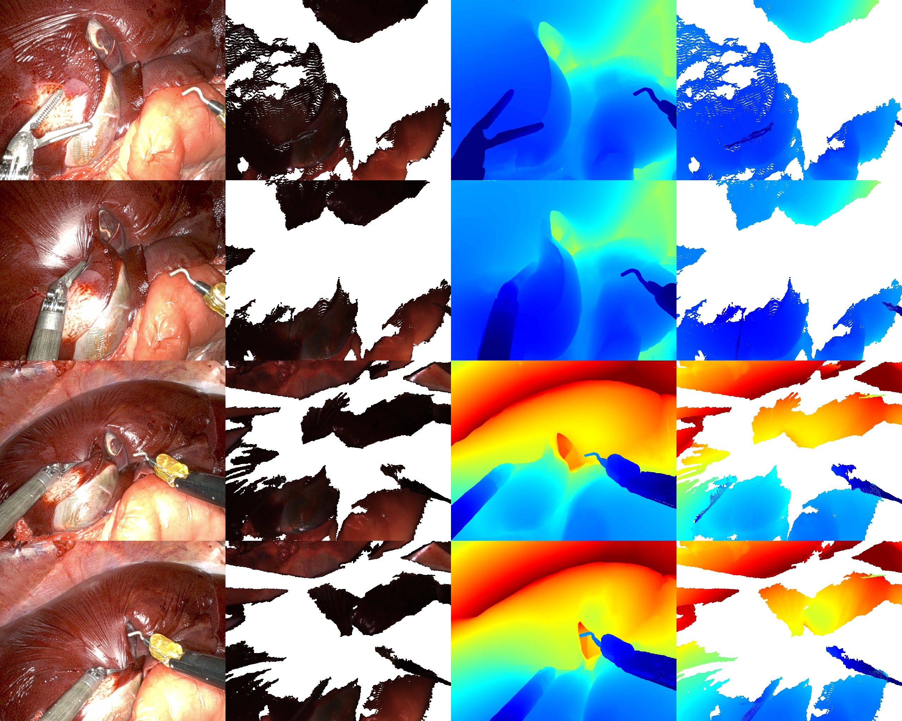

# D4D - The Dresden Dataset for 4D Reconstruction

Dataset loader for **D4D - The Dresden Dataset for 4D Reconstruction of Non-Rigid Abdominal Surgical Scenes**.

[](https://doi.org/10.25532/OPARA-1033)

**[Download the Dataset](https://doi.org/10.25532/OPARA-1033)**

Hierarchical dataset loader for surgical stereo reconstruction with Open3D visualization.

> **View the [Project Page](https://reubendocea.github.io/d4d/) for the best experience with fullscreen videos and interactive navigation.**

**Contents:** [Experimental Setup](#experimental-setup) | [Sample Sessions](#sample-sessions) | [Installation](#installation) | [Usage](#usage) | [Dataset Structure](#dataset-structure) | [Calibration](#calibration) | [Dependencies](#dependencies)

---

## Experimental Setup

<p align="center">
  
</p>

Data were acquired from porcine cadavers using a **da Vinci Xi** stereo endoscope and a **Zivid** structured-light camera, registered via optical tracking. The dataset enables quantitative geometric evaluation of 3D reconstruction in both visible and occluded regions.

## Sample Sessions

The dataset follows a three-level hierarchy: each **Specimen** (one porcine cadaver) contains one or more **Sessions** (continuous recordings, named by date and time), and each **Session** contains one or more **Clips** (the individual tissue-manipulation segments). Each item below is one **Session**, and every Session holds one or more Clips with paired endoscopic video and structured-light geometry.

**Summary images** display (left to right, for each clip row):
1. **Left endoscopic image** - Rectified stereo camera view
2. **SLC RGB rendering** - Point cloud rendered from the curated camera pose
3. **Stereo depth map** - Depth estimated from stereo matching
4. **SLC depth rendering** - Structured-light depth from the curated pose

**Quick Navigation:** [Session 1](#session-1) | [Session 2](#session-2) | [Session 3](#session-3) | [Session 4 (moved camera)](#session-4)

---

<a id="session-1"></a>
### Specimen 1 - Session 2025_03_06-16_49_40 &nbsp; [Next →](#session-2)

<p align="center">
  
</p>

<table>
<tr>
<td align="center"><b><a href="docs/files/2025_03_06-16_49_40_combined_2x2.mp4">Combined 2x2 View</a></b><br/><video src="docs/files/2025_03_06-16_49_40_combined_2x2.mp4" controls height="280"></video></td>
<td align="center"><b><a href="docs/files/2025_03_06-16_49_40_compressed.mp4">Endoscope Video</a></b><br/><video src="docs/files/2025_03_06-16_49_40_compressed.mp4" controls height="280"></video></td>
<td align="center"><b><a href="docs/files/2025_03_06-16_49_40_zivid_startend.mp4">Zivid Start/End</a></b><br/><video src="docs/files/2025_03_06-16_49_40_zivid_startend.mp4" controls height="280"></video></td>
</tr>
</table>

---

<a id="session-2"></a>
### Specimen 5 - Session 2025_09_09-15_40_48 &nbsp; [← Prev](#session-1) | [Next →](#session-3)

<p align="center">
  
</p>

<table>
<tr>
<td align="center"><b><a href="docs/files/2025_09_09-15_40_48_combined_2x2.mp4">Combined 2x2 View</a></b><br/><video src="docs/files/2025_09_09-15_40_48_combined_2x2.mp4" controls height="280"></video></td>
<td align="center"><b><a href="docs/files/2025_09_09-15_40_48_compressed.mp4">Endoscope Video</a></b><br/><video src="docs/files/2025_09_09-15_40_48_compressed.mp4" controls height="280"></video></td>
<td align="center"><b><a href="docs/files/2025_09_09-15_40_48_zivid_startend.mp4">Zivid Start/End</a></b><br/><video src="docs/files/2025_09_09-15_40_48_zivid_startend.mp4" controls height="280"></video></td>
</tr>
</table>

---

<a id="session-3"></a>
### Specimen 5 - Session 2025_09_09-15_44_02 &nbsp; [← Prev](#session-2) | [Next →](#session-4)

<p align="center">
  
</p>

<table>
<tr>
<td align="center"><b><a href="docs/files/2025_09_09-15_44_02_combined_2x2.mp4">Combined 2x2 View</a></b><br/><video src="docs/files/2025_09_09-15_44_02_combined_2x2.mp4" controls height="280"></video></td>
<td align="center"><b><a href="docs/files/2025_09_09-15_44_02_compressed.mp4">Endoscope Video</a></b><br/><video src="docs/files/2025_09_09-15_44_02_compressed.mp4" controls height="280"></video></td>
<td align="center"><b><a href="docs/files/2025_09_09-15_44_02_zivid_startend.mp4">Zivid Start/End</a></b><br/><video src="docs/files/2025_09_09-15_44_02_zivid_startend.mp4" controls height="280"></video></td>
</tr>
</table>

---

<a id="session-4"></a>
### Specimen 5 - Session 2025_09_09-16_05_53 (moved camera) &nbsp; [← Prev](#session-3)

In a **moved-camera session** the endoscope is repositioned partway through, giving two viewpoints
within one continuous recording. The Zivid camera does not move, so only the endoscopic view changes.

<p align="center">
  
</p>

<table>
<tr>
<td align="center"><b><a href="docs/files/2025_09_09-16_05_53_combined_2x2.mp4">Combined 2x2 View</a></b><br/><video src="docs/files/2025_09_09-16_05_53_combined_2x2.mp4" controls height="280"></video></td>
<td align="center"><b><a href="docs/files/2025_09_09-16_05_53_zivid_startend.mp4">Zivid Start/End</a></b><br/><video src="docs/files/2025_09_09-16_05_53_zivid_startend.mp4" controls height="280"></video></td>
</tr>
</table>

## Installation

Requires **Python 3.10**

```bash
pip install -e .
```

## Usage

```python
from d4d.loader import D4D
from visualize import visualize_clip_state

# Load dataset
d4d = D4D("/path/to/preprocessed_restructured")

# Iterate: Dataset → Specimen → Session → Clip
for specimen in d4d:
    for session in specimen:
        for clip in session:
            print(f"{clip.name}: {len(clip.left_img_paths)} images, {clip.duration:.1f}s")

# Access specific clip
specimen = next(iter(d4d))
session = next(iter(specimen))
clip = next(iter(session))

# Clip properties
clip.left_img_paths          # List of left image paths
clip.right_img_paths         # List of right image paths
clip.stereo_depth_paths      # List of depth map paths
clip.pointclouds             # Dict with 'start'/'end' Zivid PLY paths
clip.endoscope_params        # Endoscope camera parameters (fx, fy, cx, cy, baseline, width, height)
clip.zivid_params            # Zivid camera parameters
clip.poses                   # Dict with 'start'/'end' curated camera poses (4x4 matrices)

# Visualize with curated poses
if clip.pointclouds.get('start') and clip.left_img_paths and clip.stereo_depth_paths:
    visualize_clip_state(
        clip.pointclouds['start'],
        clip.left_img_paths[0],
        clip.stereo_depth_paths[0],
        clip.endoscope_params,
        clip.poses['start']
    )
```

## Dataset Structure

The dataset is organised by the Specimen / Session / Clip hierarchy. Session-level folders hold the full unrectified images, while clip-level folders hold the rectified, per-clip data.

```
d4d_dataset/
└── specimen_1/                          # a Specimen (one porcine cadaver)
    └── 2025_03_06-16_49_40/             # a Session (continuous recording)
        ├── clips.json                   # per-clip start/end frames and point clouds
        ├── camera_info/                 # specimen-level calibration
        ├── pointcloud/                  # structured-light point clouds
        ├── tf/                          # tracked transforms (Polaris)
        ├── left_images/                 # session-level UNRECTIFIED endoscope images
        ├── right_images/
        ├── depth_images/                # structured-light depth images
        ├── color_images/                # structured-light colour images
        ├── snr_images/                  # structured-light SNR images
        ├── masks/
        └── clips/
            └── Clip_1/                  # a Clip (one tissue-manipulation segment)
                ├── Clip_1.mp4           # clip preview video
                ├── left_images_rect/    # clip-level RECTIFIED endoscope images
                ├── right_images_rect/
                ├── left_images_rect_masks/
                ├── stereo_depth/        # stereo depth maps (.npy, metres)
                ├── zivid_images/        # structured-light start/end captures
                ├── zivid_masks/         # manual instrument masks
                ├── curated_camera_pose_start.txt
                ├── curated_camera_pose_end.txt
                ├── pose_bounds.npy      # LLFF-format camera poses and bounds
                └── camera_info/
```

## Calibration

The camera calibration and the corresponding checkerboard pattern are provided in [`files/sample_calibration.tar.gz`](files/sample_calibration.tar.gz). It extracts to a single `sample_calibration/` folder containing:

- The stereo camera calibration for one representative session: the left and right checkerboard images and the resulting intrinsics (`left.yaml`, `right.yaml`, `ost.txt`).
- The checkerboard pattern used for calibration, `checkerboard_9x10_10mm.pdf` (9x10, 10 mm squares).

## Dependencies

numpy, opencv-python, PyYAML, open3d, trimesh, tqdm 